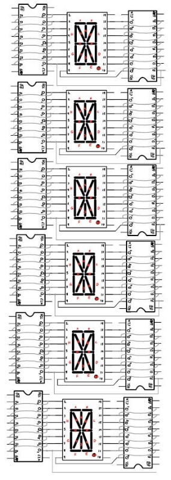
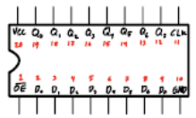
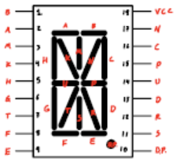
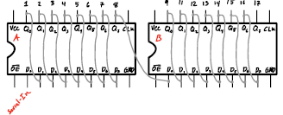
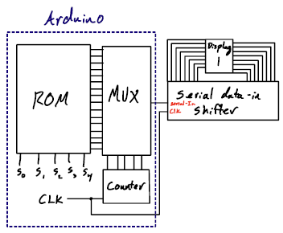
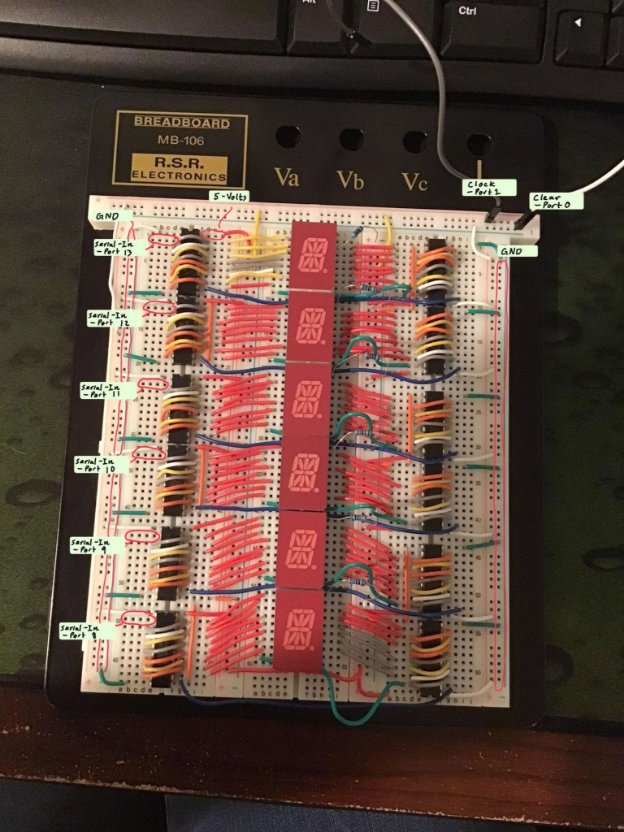
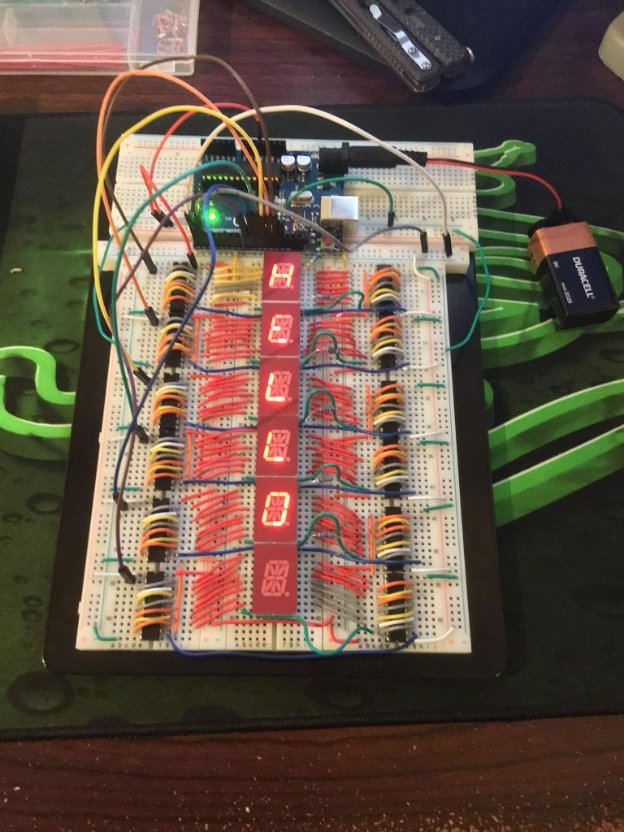

**Bill of Materials**

12 – TC74HC574PF: 8Bit D-Type Flip-Flop 6 – LTP-587HR: 16 Segment LED Display 6 – 220 Ohm Resistors

1 – Arduino-Uno Rev3

1 – Solderless Breadboard

Many – Jumper wires

**Project Objective:**

Using only one output, control a single 16-segment LED Display, and do some cool stuff with that.

**Build Instructions:**

*See Figures 1 and 2 for general layouts for TC74HC574PF ic and LTP-587HR display, respectively.*

1. **Arrange Registers:**

Begin by planning the layout of your registers. Depending on the number of displays you intend to control, this step may require some consideration. Experiment with layouts to optimize space utilization and minimize wire length. For standard-sized breadboards, I recommend adopting the configuration depicted in Figure 3 for sleekness and efficiency.

2. **Connect Power and Ground:**

Once your register layout is established, ensure each register is individually linked to both 5 volts and ground. For TC74HC574PF, ground connection is made through pin 10, while pin 20 is designated for 5 volts.

3. **Establish Clock and Output Enable Connections:**

To facilitate control operations later on, each register needs to be connected in series with clear and CLK. For TC74HC574PF, CLK corresponds to pin 11, while clear is represented by pin 1.

4. **Construct Shift-In/Parallel-Out Register:**

Connect pairs of registers according to the configuration outlined in Figure 4.

5. **Organize 16-Segment Displays:**

Similar to register arrangement, devise a layout strategy for your displays. The options may be somewhat constrained by the orientation of rows and columns on a standard solderless breadboard. Refer to Figure 4 for guidance on how to position displays relative to registers.

6. **Establish Connections to Registers:**

Ensure proper mapping of each register output to the corresponding display pin. Figures 2, 3, and 4 provide the correct connection references.

7. **Supply Power to Displays:**

For each 16-segment display, use a 220-ohm resistor to connect pin 18 to power.

8. **Connect Arduino:**

The Arduino serves multiple functions in this project, such as ROM, MUXer, Counter, and CLK. Refer to Figure 6 for a summarized overview. Keep in mind that the Arduino also fulfills additional roles, and its programming may deviate somewhat from the actual behavior of these components.

9. **Compile Arduino Sketch:**

Utilize the Arduino IDE to input the project's code. Connect your Arduino Uno to your computer, select Arduino Uno as the Board, specify the port, and compile the sketch onto your Arduino.

10. **Establish Power and Ground Connections:**

In this project, the Arduino is the central hub for power and ground. Connect each register to ground and each register and display to the 5V ports.

11. **Connect Clock and Clear Signals:**

In the project's program file, Clear is assigned to the Arduino's 0th port, while CLK is assigned to the 1st. Connect each register to the CLK and clear ports appropriately.

12. **Connect Outputs to Serial-In Pins:**

In the Arduino’s program, port 13 corresponds to the first display, and port 8 corresponds to the last display. Ensure that port 13 is connected to the display representing the first letter and port 8 is connected to the display representing the last letter. These ports should be attached to the Serial-In of each pair of registers, as depicted in Figure 4.

13. **Power On:**

Supply power to the Arduino either using the 9-volt battery adapter or by connecting it to a computer via a USB cable.

**Purpose of the product:**

This project aimed to create a fun way for me to display phrases or sentences in my office cube. There are many other things I would like to integrate into this product, such as a way for it to be turned on and off, besides plugging and unplugging the 9-volt battery. I would also like to integrate some kind of menu system where I can choose which sentence to display. Right now, this product is a single rolling display.

Figure 3

Figure 1 

Figure 2 

Figure 4 

Figure 5 

